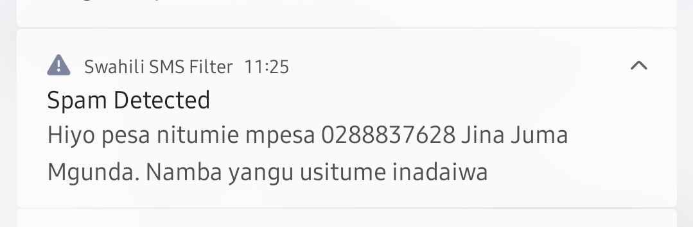
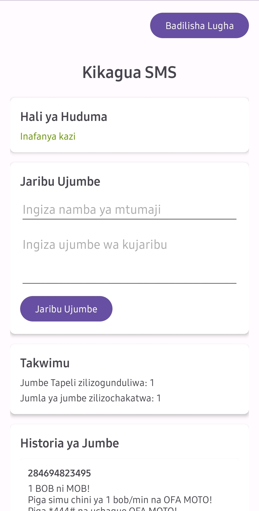
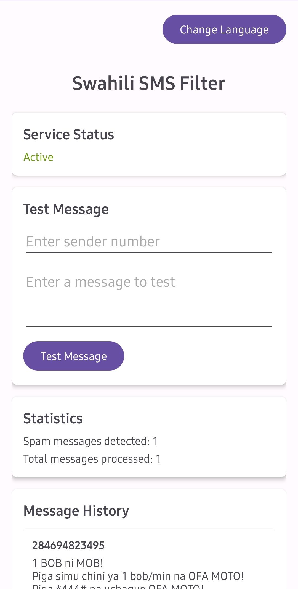

# Swahili SMS Filter

A full-stack android application that leverages machine learning to detect and filter spam SMS messages in real-time for Swahili-speaking users. The project consists of a native Android app that performs on-device spam classification using a pre-trained logistic regression model.

## Features

- **On-device SMS Spam Detection:** Classify incoming messages as spam or legitimate using a custom pre-trained logistic regression model.
- **Real-time Notifications:** Instant alerts about detected spam messages.
- **Message History:** Track and review all processed messages.
- **SMS Receiver Integration:** Automatic processing of incoming SMS.
- **Local Database Storage:** Secure storage of message history.
- **User-friendly Interface:** Clean and intuitive UI for easy navigation.

## Project Structure

```
swahili-sms-filter-android/
├── app/
│   ├── src/
│   │   ├── main/
│   │   │   ├── java/com/example/swahilismsfilter/
│   │   │   │   ├── MainActivity.java              # Main application interface
│   │   │   │   ├── MessageDatabaseHelper.java     # Database operations
│   │   │   │   ├── MessageHistoryAdapter.java     # RecyclerView adapter for message history
│   │   │   │   ├── NotificationHelper.java        # Handles system notifications
│   │   │   │   ├── SmsProcessingService.java      # Background service for SMS processing
│   │   │   │   ├── SmsReceiver.java               # Broadcast receiver for incoming SMS
│   │   │   │   └── SpamClassifier.java            # ML model implementation
│   │   │   ├── res/                               # Android resources
│   │   │   └── AndroidManifest.xml                # App configuration
│   │   └── androidTest/                           # Instrumentation tests
│   └── build.gradle                               # App-level build configuration
├── gradle/                                        # Gradle wrapper
├── build.gradle                                   # Project-level build configuration
└── README.md                                      # This file
```

## Screenshots






## Technical Implementation

### SMS Processing Flow

1. **Incoming SMS Detection:**
   - `SmsReceiver.java` listens for incoming SMS messages
   - Broadcasts are registered in the manifest with appropriate permissions

2. **Message Classification:**
   - `SpamClassifier.java` processes messages using the pre-trained logistic regression model
   - On-device classification ensures privacy and offline functionality

3. **Database Management:**
   - `MessageDatabaseHelper.java` handles storage of message history
   - SQLite database implementation with custom schema

4. **Notification System:**
   - `NotificationHelper.java` manages the creation and display of system notifications
   - Real-time alerts for detected spam messages

5. **UI Components:**
   - `MainActivity.java` serves as the primary interface
   - `MessageHistoryAdapter.java` displays the message history in a RecyclerView

### Machine Learning Model

The application uses a custom-built logistic regression model specifically trained for Swahili SMS messages. The model was trained on a dataset of labeled Swahili messages and achieves high accuracy in spam detection.

## Prerequisites

- Android Studio 4.0+
- Android SDK 21+
- JDK 8+

## Installation

1. **Clone the Repository:**

   ```bash
   git clone https://github.com/yourusername/swahili-sms-filter-android.git
   cd swahili-sms-filter-android
   ```

2. **Open in Android Studio:**
   - Launch Android Studio
   - Select "Open an existing Android Studio project"
   - Navigate to the cloned repository and select it

3. **Build the Project:**
   - Click "Build" > "Make Project"
   - Resolve any dependency issues if prompted

4. **Run on Device/Emulator:**
   - Connect an Android device or start an emulator
   - Click "Run" > "Run app"

## Required Permissions

The application requires the following permissions:
- `READ_SMS`: To access incoming SMS messages
- `RECEIVE_SMS`: To be notified of new SMS messages
- `INTERNET`: For model updates (if applicable)
- `VIBRATE`: For notification alerts

## Development

### Adding Features

To extend the application with new features:

1. **Update ML Model:**
   - Train an improved model using scikit-learn
   - Export the model and place it in the assets folder
   - Update `SpamClassifier.java` to use the new model

2. **Enhance UI:**
   - Modify layouts in the `res/layout` directory
   - Update `MainActivity.java` and adapters accordingly

3. **Improve Notifications:**
   - Extend `NotificationHelper.java` with additional notification channels or styles

### Testing

Run the included instrumentation tests to verify functionality:

```bash
./gradlew connectedAndroidTest
```

## Troubleshooting

- **Permission Issues:**
  Ensure all required permissions are granted in the app settings.

- **SMS Detection Problems:**
  Some Android versions restrict background SMS reception. Check battery optimization settings.

- **Classification Errors:**
  The model may need retraining with more diverse data if false positives/negatives occur.

## Future Enhancements

- Cloud synchronization for message history
- Multi-language support
- User feedback loop for model improvement
- Advanced filtering rules and whitelist/blacklist options

## License

[MIT License](LICENSE)

## Acknowledgements

- Android SDK for mobile application development
- scikit-learn for machine learning model training
- Open-source Swahili datasets contributors
